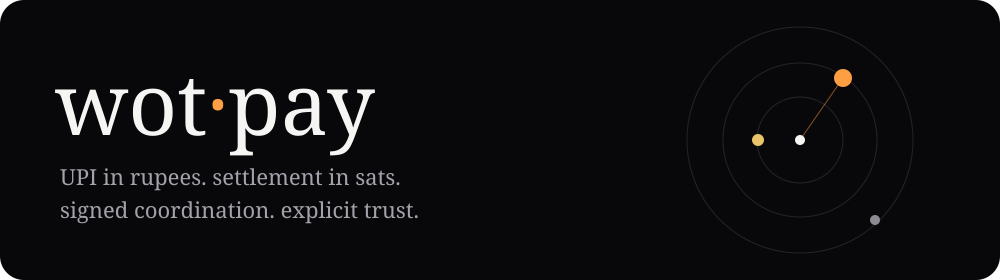

<div align="center">



**scan a UPI QR. let your web of trust do the matching. settle in sats.**

[Live demo](https://wot-pay.vercel.app/) · [Phone checklist](docs/device-checklist.md) · [MIT](LICENSE)

Freedom Stack (Nostr + Ecash) · BOSS Battle, Bitshala · built by siddhant

</div>


*Local UI preview with sample offers, not live relay data or proof of payment.*

## why

UPI and sats don't share a payment rail. I built a Nostr client that lets someone post a UPI payment request and someone else pay it in exchange for sats. No bridge server holds the funds. The trade still depends on people keeping their promises.

This is a hackathon prototype, not ready for public money use. The live demo may be behind this branch. A production build and unit tests are not evidence of a successful real payment.

## how it works

```text
scan or type UPI -> signed offer -> claim -> pay UPI externally
                                          -> send sats externally -> both stamp
```

1. The maker scans a QR or types a UPI ID, sets INR and sats, and posts an offer.
2. Share the public offer link using Copy public offer link. A recipient opens it directly on the board; no automatic message is sent to your follows.
3. The board ranks offers using follows, hop distance and public settled/disputed stamps. It also shows people outside your graph.
4. The taker claims and opens their UPI app. The app does not verify that payment.
5. The maker sends Lightning from their wallet, or pastes an existing Cashu token for private delivery.
6. Each side stamps settled or disputed. These are signed statements, not verified payment receipts.

## the trust orbit

The orbit shows how far a key is from your chosen graph root: yourself, a direct follow, a distant hop, or an outsider. The browser fetches up to two follow-list layers by default. Settles raise the ranking score; disputes lower it. Only stamps from authors in your graph count.

Following someone is not a payment guarantee. In-graph collusion can manufacture reputation, even when the referenced signed offer and claim exist. The ranker requires trade existence and maker/taker participation, but cannot prove money changed hands. A pasted npub selects whose follows to read; it does not authenticate you as that person.

Add/remove follows inside Profile under People I follow / trust. Each edit is reviewed and explicitly confirmed before publishing a merged standard Nostr follow list. It edits the signed-in identity, not a pasted third-party graph. Relay omissions can still hide the latest list.

## what stays public, and what stays private

- Offers include the UPI ID, payee name, amount, sats and optional mint URL. They are public on Nostr relays. Graph ranking is not access control.
- Claims, receive hints and settled/disputed stamps are public signed events: kinds 3401, 3402, 3403 and 3404. Claim releases use signed kind-5 deletion requests.
- Cashu tokens move as NIP-17 encrypted gift wraps, not public offer content. A token-shaped-value fence checks outgoing content and tags. It is a leak-prevention heuristic, not a guarantee against every encoded secret.
- Signatures detect changes to an event. Relays can still read public events, refuse delivery or disappear. The app uses relay.damus.io, nos.lol and relay.primal.net; there is no relay editor in the UI.

## cashu hand-off

Cashu is integrated as token delivery, not as a wallet or escrow. The maker pastes a token from their own wallet. The app reads its mint, amount and unit, refuses short/wrong-unit/wrong-mint sends, encrypts it to the taker, and offers Copy token / Open wallet on receipt.

The app does not mint, redeem, verify unspent proofs or lock funds. "Sent" means a relay accepted the encrypted message, not that the recipient redeemed money. The sender retains the bearer token and could spend it first. Redeem it in a compatible wallet before claiming settlement. Trust in the Cashu mint remains.

Token DMs require the device-generated key. A NIP-07 extension signs public events but currently cannot wrap/open token DMs here; use Lightning for that path. Device nsec import/export and persisted signer choice are implemented. A bunker-link NIP-46 path is implemented with secure relay validation, timeout and signed-event checks, but a real external remote signer has not yet been verified. Never send your nsec in chat.

## agent (optional)

A separate rules-based daemon claims offers from the owner's direct follows, within an amount limit, and privately asks the owner to pay. It handles `paid`, `skip`, `got`, `no`, `status`, `pause` and `resume`. It never opens UPI or sends money. It is not hosted by the Vercel demo.

```sh
OWNER=npub1... LN_ADDRESS=you@wallet.com MAX_INR=500 npm run agent
```

The daemon has its own `.agent-key`. Active trade state and signed delivery queue persist in `.agent-state.json`, tied to the owner and agent key. Failed messages retry in order; final success waits for the stamp to publish. Skip sends a signed claim deletion request that updated clients honor. Paid-trade race recovery has local regression tests. A full real relay/owner-DM restart test is still unverified; do not leave it managing real trades unattended.

## run it

Node 22.12 or newer and npm. No application database, API key or backend service.

```sh
git clone https://github.com/SIDDHANTCOOKIE/wot-pay.git
cd wot-pay
npm ci
npm test
npm run dev
```

The browser generates a local signing key on first load. It is stored in plaintext localStorage, with an explicit export/import backup UI. Clearing site data loses that identity and access to its encrypted messages. Treat this as a demo key, not your primary wallet key.

For a no-money state-flow demonstration, open a normal and private window, post using a sample UPI ID, claim with a sample Lightning address, and stamp both sides. Those buttons alone do not move or verify money. Label the demonstration simulated.

Camera access needs HTTPS on a phone. Use the [live demo](https://wot-pay.vercel.app/) and [phone checklist](docs/device-checklist.md). Use a test mint for ecash demonstrations and do not pay a real UPI request without deciding to spend that money.

```sh
npm run build   # dist/
npm run preview
```

`npm run smoke` publishes public test events with throwaway keys and reads them back. It is not read-only and does not test payment settlement.

## validation status

- Main: 75 unit tests and production build passed in the October 4 review.
- Design-v2-focus: 99 unit tests and production build passed before these hardening changes.
- This branch: 136 unit tests and production build passed. It adds malformed-event, paise and matched-stamp regression tests. It includes a screen error fallback and catches invalid claim construction.
- No verified full phone UPI/Lightning payment or real Cashu redemption is recorded in this review. Browser/helper mocks are not an end-to-end payment test.
- Demo video: not recorded/linked yet. Hosted demo exists; branch-only work is not automatically live.

## where trust remains

| Dependency | What can still go wrong |
| --- | --- |
| Counterparty | Pays or sends nothing, lies in a stamp, races claims |
| UPI bank / NPCI | INR leg stays fully intermediated; this app cannot change that |
| Cashu mint | Redemption depends on the selected mint |
| Nostr relays | Read public data, censor, omit history, go offline |
| Static host / browser | Availability and integrity of delivered code; local key storage |

There is no atomic swap, UTR verification, custody or escrow. Deterministic claim ordering only agrees when devices see the same events. A pending/lost claim is visible and payment links are withheld while pending, but the settling buffer is not finality. The browser loads one day of board events; recovery of older trades is limited. Settlement risk is made visible, not removed or economically measured.

## next

Before submission: test the chosen deployed build on two devices, redeem a test-mint token, record the demo and save the submission receipt.

After that: real bunker/phone/daemon restart validation, stronger settlement proof, safer key storage, relay choice and longer history. Optional optimistic escrow for the sats leg remains an unbuilt stretch, not a feature of this submission.

## license

MIT. See [LICENSE](LICENSE).
